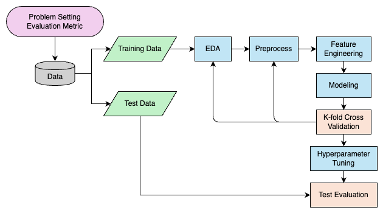
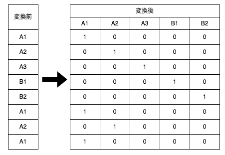
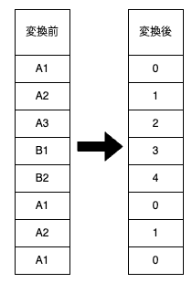
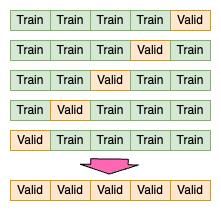
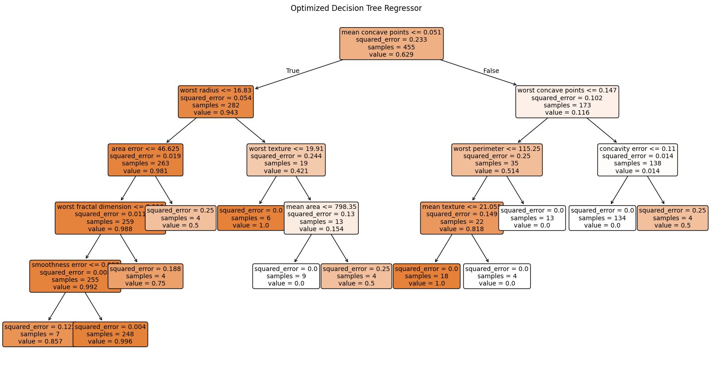
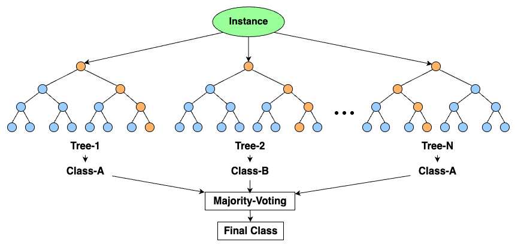

<!--
_class: lead
_paginate: false
_header: ""
_footer: ""
-->
## 250604
# Start-up Seminar for B4
## Shunta Kochi


---
<!--
_paginate: false
_header: ""
_footer: ""
-->
# Agenda

1. 機械学習とは何か
2. 機械学習プロジェクトの進め方
 

---
<!--
_class: sublead
_paginate: false
_header: ""
_footer: ""
-->

# 1. 機械学習とは何か？

---

**1. 機械学習とは何か？**

## 1-1. 機械学習とは
大量のデータから **入力→出力** の関係を学習し，未知データも予測できるアルゴリズムの集合

### なぜ機械学習か？

<div class="indent">
機械学習は次のような問題を得意とする

- 既存のソリューションでは、手作業による大量の微調整や、ルールの長いリストが必要な問題
- 伝統的な方法ではよいソリューションが作れない複雑な問題
- 環境が変動するシステム
- 複雑なシステムや大量のデータについての知見の獲得

</div>

---

**1. 機械学習とは何か？**

## 1-2. 機械学習のタイプ
1. 教師あり学習
    
    アルゴリズムに与える訓練データの中に「ラベル（label）」と呼ばれる答えが含まれる
    入力データと正解データの関係性を関数として近似する
    ex） 回帰（連続値）、分類（離散値）

2. 教師なし学習
    
    ラベルなしデータを取り扱い、データの潜在的なパターンを学習する
    ex）クラスタリング、主成分分析
    
3. 強化学習
    
    エージェント(Agent)が環境と相互作用しながら報酬(Reward)を最大化するような行動戦略(ポリシー)を学習する

---
<!--
_class: sublead
_paginate: false
_header: ""
_footer: ""
-->

# 2. 機械学習プロジェクトの進め方

---

**2. 機械学習プロジェクトの進め方**

## 2-1. 概要
本講義では、機械学習プロジェクトの進め方について、各プロセスを実際に手を動かしつつ学び、機械学習にとどまらないデータサイエンスの基礎を教えることを目的とする


---

**2. 機械学習プロジェクトの進め方**

## 2-2. 問題設定
機械学習を使うことによってどのような問題を解決したいのか、という目的を明確化しなければならない
この目的の明確化によってどのようなデータや評価指標を使って、どのようなモデリングを行うかが決まる

よくある勘違い
- 機械学習・AI を使えばなんでも解決する → そんなわけない、ただの数学と統計
- より複雑なモデルの方が優れている → 問題によってはシンプルなモデルの方が適していることもある

何を解決したいのかをプロジェクトを通じて意識することでそこがブレないようになる


---

**2. 機械学習プロジェクトの進め方**

## 2-3. 評価指標の定義
評価指標とは、学習させたモデルの性能やその予測値の良し悪しを図る指標である

**評価指標の例**
<div class="indent">
    <strong>回帰</strong>
        <div class="indent">
            <strong>RMSE（Root Mean Squared Error）</strong>
             <ul>
                <li>各レコードの目的変数と予測値の差の二乗をとり、それらを平均した後に平方根を取ることで計算される</li>
            </ul>
        </div>
</div>

$$
\text{RMSE}=\sqrt{\frac{1}{N}\sum_{i=1}^N(y_i-\hat{y_i})^2}
$$

<div class="indent">
        <div class="indent">
            <strong>RMSE（Root Mean Squared Error）</strong>
             <ul>
                <li>真の値と予測値の差の絶対値の平均によって計算される</li>
            </ul>
        </div>
</div>

$$
\text{MAE}=\frac{1}{N}\sum_{i=1}^N|y_i-\hat{y_i}|
$$

---

**2. 機械学習プロジェクトの進め方**

## 2-3. 評価指標の定義

**評価指標の例**
<div class="indent">
    <strong>分類</strong>
        <div class="indent">
            <strong>混同行列</strong>
        </div>
</div>

|         | **予測: 正例** | **予測: 負例** |
|---------|------------|------------|
| **真の値: 正例** | TP | FN |
| **真の値: 負例** | FP | TN |

<div class="indent">
        <div class="indent">
            <strong>Accuracy</strong>
        </div>
</div>

$$
\text{accuracy}=\frac{TP+TN}{TP+TN+FP+FN}
$$

<div class="indent">
        <div class="indent">
            <strong>precision と recall</strong>
        </div>
</div>

$$
\text{precision}=\frac{TP}{TP+FP} \space\space\space\space\space\space\space\space
\text{recall}=\frac{TP}{TP+FN}
$$

---

**2. 機械学習プロジェクトの進め方**

## 2-4. データの分割
データを訓練データセットとテストデータセットに分割し、訓練データセットでモデルを訓練してからテストデータセットでテストすることでモデルが適切に汎化するかどうかを確かめる

**ポイント**
- EDA やデータの前処理など、実際にデータを触る前にデータを分割しておくことが重要
    - データの前処理として欠損値を平均値で埋める、という作業を行った場合、テストデータセットの値が使われてしまう
- 汎化性能を確かめるための情報が訓練時に入り込んでしまうことを「leak」と呼ぶ
- 時系列データの場合、時間に沿って分割しないと leak になってしまう

---

**2. 機械学習プロジェクトの進め方**

## 2-5. EDA (Exploratory Data Analysis)
データの全体像を把握し、前処理やモデリングに活用する

**プロセス**
1. データの取得と準備

2. データの概要を把握（件数、平均値、中央値、最大値、最小値、標準偏差、欠損値、外れ値 etc..）

3. データの可視化

<div class="indent">
    <div class="indent">
        <ul>
            <li>Categorical Data: 円グラフ、バイオリンプロット、棒グラフ、ボックスプロット
        </ul>
    </div>
    <div class="indent">
        <ul>
            <li>Numerical Data; ヒストグラム、散布図、相関行列
        </ul>
    </div>
</div>

---

**2. 機械学習プロジェクトの進め方**

## 2-6. 前処理

### 1. 欠損値処理
機械学習モデルは `NaN` を扱うことができないため、次のいずれかを用いて処理する

- 削除：欠損行・欠損列を削除
- 補完：平均値・中央値・最頻値などで埋める
- 特別な値で埋める：`-999`や`"missing"`など
    ＝ 欠損していること自体に意味があると考える

---

**2. 機械学習プロジェクトの進め方**

## 2-6. 前処理

### 2. スケーリング
特徴量のスケールが異なると、勾配・距離ベースのアルゴリズムで違いが出てしまう（モデルによっては不要）
<p class="indent">ex） 身長（150〜200）と体脂肪率（10〜30）</p>

次のいずれかの処理を行う

- 標準化：平均 0 ・標準偏差 1 にする

$$
Z=\frac{x-\mu}{\sigma}
$$

- 正規化：データを [0, 1] の範囲にスケーリング

$$
x' = \frac{x - x_{\min}}{x_{\max} - x_{\min}}
$$

---

**2. 機械学習プロジェクトの進め方**

## 2-6. 前処理

### 3. カテゴリ変数のエンコーディング
機械学習モデルは「文字列」を扱えないため、数値に変換する必要がある

<div class="flex-2col">
    <div class="col">
        One-Hot Encoding：独立したフラグ列を作る
        
    </div>
    <div class="col">
        Label Encoding：整数ラベルに変換
        
    </div>
</div>


---

**2. 機械学習プロジェクトの進め方**

## 2-6. 前処理

### 4. 外れ値処理
極端な値がモデルの学習を歪める可能性があるため、外れ値を処理する必要がある

- 閾値で除去
- 対数変換で影響を小さくする

---

**2. 機械学習プロジェクトの進め方**

## 2-7. 特徴量エンジニアリング

- 前処理：モデルにデータを特徴量として入力できるような形に「きれいにする」
- 特徴量エンジニアリング：モデルの精度を向上させることを目的として、モデルが学習しやすい「意味のある特徴を作る」

### 1. 特徴量の選択
<div class="indent">
    関係のない or 冗長な特徴を削除し、過学習を防ぐ & 学習を早くする
        <div class="indent">
            ex）
            <div class="indent">
                <ul>
                    <li>相関係数による削除
                    <li>木系モデルの feature_importances_
                    <li>L1 正則化 (Lasso)
                </ul>
            </div>
        </div>
</div>


---

**2. 機械学習プロジェクトの進め方**

## 2-7. 特徴量エンジニアリング

### 2. 特徴量の生成
<div class="indent">
    元のデータを組み合わせて新しい特徴量を作成する
        <div class="indent">
            ex）
            <div class="indent">
                <ul>
                    <li>日付 -> 曜日、月、時間帯
                    <li>地域 -> 人口密度、距離
                    <li>2つの特徴量の差分や比率を取る（一番多い気がする）
                </ul>
            </div>
        </div>
</div>


---

**2. 機械学習プロジェクトの進め方**

## 2-7. 特徴量エンジニアリング

### 3. 特徴量の変換
<div class="indent">
    分布やスケールを整えて、モデルが学習しやすくする
        <div class="indent">
            ex）
            <div class="indent">
                <ul>
                    <li>対数変換：外れ値を圧縮
                    <li>Box-Cox変換：分布を正規分布に近づける
                </ul>
            </div>
        </div>
</div>


---

**2. 機械学習プロジェクトの進め方**

## 2-7. 特徴量エンジニアリング

### 4. 特徴量の変換
<div class="indent">
    カテゴリや連続値を、モデルが処理しやすい形にする
        <div class="indent">
            ex）
            <div class="indent">
                <ul>
                    <li>グループ化：年齢=31 -> 年齢_bin=30代
                    <li>分解：住所 -> 都道府県市区町村
                    <li>上位カテゴリへの変換：商品 ID -> カテゴリ名
                </ul>
            </div>
        </div>
</div>

---

**2. 機械学習プロジェクトの進め方**

## 2-8. モデリング

モデリングとは、整えたデータを使って「入力 -> 出力」の対応関係を学習する関数（モデル）を構築するプロセス

###  代表的な機械学習モデル一覧（例）

| モデル名 | タスク | 特徴 | 利用例 |
|---------|--------|------|--------|
| 線形回帰 | 回帰 | 単純な線形関係を学習・解釈性が高い | 売上予測、温度予測 |
| ロジスティック回帰| 分類 | 出力が確率、二値分類に適する | スパムメール判定 |
| 決定木| 分類 / 回帰 | 木構造で直感的、過学習に注意 | 顧客分類、価格予測 |
| ランダムフォレスト| 分類 / 回帰 | 複数の決定木の集合で高性能 | 医療診断、信用スコア |
| 勾配ブースティング| 分類 / 回帰 | 高精度、高速、特徴重要度も算出 | コンペ、業務システム |
| k近傍法 | 分類 / 回帰 | シンプル、距離ベース | パターン認識、画像分類 |
| SVM | 分類 / 回帰 | マージン最大化、高次元に強い | 顔認識、文書分類 |

---

**2. 機械学習プロジェクトの進め方**

## 2-8. モデリング

###  代表的な機械学習モデル一覧（例）

| モデル名 | タスク | 特徴 | 利用例 |
|---------|--------|------|--------|
| PCA (主成分分析) | 次元削減 | データ圧縮、可視化に便利 | ノイズ除去、前処理 |
| k-means | クラスタリング | 教師なしでグルーピング | 顧客分類、画像圧縮 |
| ニューラルネットワーク| 分類 / 回帰 | 複雑な関係を学習可能 | 音声・画像認識 |
| 畳み込みNN (CNN) | 画像処理系 | 画像の空間構造に強い | 顔認識、物体検出 |
| 再帰型NN (RNN, LSTM, GRU) | 時系列・文章 | シーケンス処理に特化 | 翻訳、株価予測、音声認識 |

※ 各モデルの詳細は、この時間内に教えることは不可能なので、自分が行う研究で用いる場合に都度都度勉強する

---


**2. 機械学習プロジェクトの進め方**

## 2-8. モデリング

###  過学習（Overfitting）
<div class="indent">
    学習データのランダムなノイズまで学習してしまい、学習データではスコアがいいが、それ以外のデータでスコアが悪くなること
    <br>
    逆に、十分に学習データの性質が学習できていなく、学習データでもそれ以外のデータでもスコアがよくないことをアンダーフィッティングと呼ぶ
</div>

---

**2. 機械学習プロジェクトの進め方**

## 2-8. モデリング

### モデルの評価
<div class="indent">
    予測モデルを作成する主な目的：未知のデータに対して高い精度で予測を行うこと<br>
    モデルの作成は一度で終わることはなく、一度作成して評価をし、特徴量エンジニアリングやモデルの再構築などを繰り返し行なっていくことによって精度改善をしていく<br>
    しかし、この精度改善を行うための評価をテストデータセットを使って行なってはいけない
    <div class="indent">
        せっかく、モデルの汎化性能を確かめるために分離しておいたのに、そのテストデータセットでの評価が高まるようにモデル構築プロセスを反復することになってしまうから
    </div>
    -> 学習データを学習に用いるデータとバリデーションデータ（評価用のデータ）に分け、バリデーションデータへの予測の精度を何らかの評価指標によるスコアで表すことで評価する
</div>

---

**2. 機械学習プロジェクトの進め方**

## 2-8. モデリング

### バリデーションの手法
<div class="flex-2col">
    <div class="col">
        <strong>1. hold-out 法</strong>
        
    </div>
    <div class="col">
       <strong> 2. K-fold Cross Validation</strong>
        
    </div>
</div>

---

**2. 機械学習プロジェクトの進め方**

## 2-9. ハイパーパラメータチューニング

**ハイパーパラメータとは**
<div class="indent">
    学習の前に指定し、学習の方法や速度、どれだけ複雑なモデルにするかを定めるパラメータのこと
    <div class="indent">
        ex）ハイパーパラメータの例
    </div>
</div>

$$\space$$

<table>
    <thead>
        <tr>
        <th>モデル</th>
        <th>ハイパーパラメータ</th>
        <th>意味</th>
        </tr>
    </thead>
    <tbody>
        <tr>
        <td>線形回帰（Ridge）</td>
        <td>alpha</td>
        <td>正則化の強さ（大きいほど単純）</td>
        </tr>
        <tr>
        <td>決定木</td>
        <td>max_depth, min_samples_split</td>
        <td>木の深さ、枝分かれの最小データ数</td>
        </tr>
        <tr>
        <td>Random Forest</td>
        <td>n_estimators</td>
        <td>木の本数</td>
        </tr>
        <tr>
        <td>SVM</td>
        <td>C, kernel, gamma</td>
        <td>ペナルティの大きさ、カーネルの種類など</td>
        </tr>
        <tr>
        <td>XGBoost / LightGBM</td>
        <td>learning_rate, num_leaves, max_depth</td>
        <td>学習率・モデルの複雑さ</td>
        </tr>
        <tr>
        <td>ニューラルネット</td>
        <td>learning_rate, batch_size, num_layers</td>
        <td>学習率、バッチサイズ、層の深さなど</td>
        </tr>
    </tbody>
</table>

---

**2. 機械学習プロジェクトの進め方**

## 2-9. ハイパーパラメータチューニング

**なぜハイパーパラメータチューニングが必要なのか**
<div class="indent">
    <ul>
        <li>ハイパーパラメータ次第でモデル性能が大きく変わる
        <li>デフォルト設定では最適な精度が出ないことが多い
        <li>モデルが過学習 / 未学習になるのを防げる
    </ul>
</div>

$$\space$$

<table>
  <thead>
    <tr>
      <th>方法</th>
      <th>説明</th>
      <th>実装方法</th>
    </tr>
  </thead>
  <tbody>
    <tr>
      <td>手動チューニング</td>
      <td>経験や試行錯誤で値を変えてみる</td>
      <td>手で変更して再学習</td>
    </tr>
    <tr>
      <td>グリッドサーチ（Grid Search）</td>
      <td>全組み合わせを試す</td>
      <td>GridSearchCV</td>
    </tr>
    <tr>
      <td>ランダムサーチ（Random Search）</td>
      <td>ランダムに一部を試す</td>
      <td>RandomizedSearchCV</td>
    </tr>
    <tr>
      <td>ベイズ最適化</td>
      <td>精度を予測しながら効率的に探索</td>
      <td>Optuna, Hyperopt</td>
    </tr>
  </tbody>
</table>


---
<!--
_class: sublead
_paginate: false
_header: ""
_footer: ""
-->

# 3. 機械学習モデル：決定木

---

**3. 機械学習モデル：決定木**

## 3-1. 決定木の概要



- 決定木とはデータをある条件に従って分割することにより、データの分類または回帰のモデルを作成するアルゴリズム
- 分類を行う分類木と回帰を行う回帰木を総称して決定木と呼ぶ


---

**3. 機械学習モデル：決定木**

## 3-2. 決定木の学習アルゴリズム


1. すべてのデータを根ノードに置く  

2. すべての特徴 × すべての分割点 に対して「どの分割が一番良いか？」を計算  
   ex）身長 ≤ 160cm で分割したらどうなる？

3. 「最も不純度が下がる」分割を採用する  
    <div class="indent">
        <ul>
            <li>分類（クラスが混ざっている度合い）：ジニ不純度、エントロピー
            <li>回帰（値のばらつき）：分散
        </ul>
    </div>

4. 子ノードに分割して、同じ処理を再帰的に繰り返し、停止条件を満たしたら分割を終了する
5. 葉ノードで予測を行う
    <div class="indent">
        <ul>
            <li>分類：多数決（最も多いクラスを出力）
            <li>回帰：平均値（そのノードにある目的変数の平均
        </ul>
    </div>

---

**3. 機械学習モデル：決定木**

## 3-3. 決定木の長所と短所


<div class="indent">
長所
    <div class="indent">
        <ul>
            <li>解釈しやすい（透明性が高い）
            <li>前処理がほぼ不要（スケーリング不要、数値・カテゴリ混在でもOK、欠損値の処理も）
            <li>非線形な関係も捉えられる
            <li>推論（予測）が速い
        </ul>
    </div>
短所
    <div class="indent">
        <ul>
            <li>過学習（オーバーフィッティング）しやすい
            <li>精度が頭打ちになりやすい
            <li>不安定（バリアンスが高い）
            <li>連続値に対する境界が階段状
        </ul>
    </div>
</div>

---

**3. 機械学習モデル：決定木**

## 3-4. 決定木 × アンサンブル学習

**アンサンブル学習とは？**
$$\space$$
<div class="indent">
    複数の弱いモデル（例：決定木）を組み合わせて、より強い予測モデルを作る手法
</div>

$$\space$$

<table border="1" cellspacing="0" cellpadding="8">
  <thead>
    <tr>
      <th>タイプ</th>
      <th>代表例</th>
      <th>アイデア</th>
    </tr>
  </thead>
  <tbody>
    <tr>
      <td><strong>バギング</strong></td>
      <td>ランダムフォレスト</td>
      <td>多数の木を<strong>並列</strong>に学習し、<br>平均または多数決で予測</td>
    </tr>
    <tr>
      <td><strong>ブースティング</strong></td>
      <td>XGBoost / LightGBM</td>
      <td>木を<strong>逐次</strong>に追加し、<br>前の誤りを修正していく</td>
    </tr>
  </tbody>
</table>

決定木の限界を振り返ると：「単体だと過学習しやすい（ノイズに過敏）」「精度が頭打ち（境界が階段状で滑らかでない）」「データの変更に不安定」

-> これを補うのが「多数の木を組み合わせて使う」アンサンブル学習！

---

**3. 機械学習モデル：決定木**

## 3-5. ランダムフォレスト

**ランダムフォレストとは？**
$$\space$$
<div class="flex-2col">
    <div class="flex-col">
        <div class="flex-text">
            多数の決定木を学習させて、その平均または多数決で予測するモデル
            <div class="indent">
                <ul>
                    <li>各木は異なるデータサンプル・特徴量を使って学習される
                    <li>決定木の「不安定さ（バリアンス）」を多数でならすことで安定化
                </ul>
            </div>
        </div>
    </div>
    <div class="flex-img">
    
    </div>
</div>

---
<!--
_class: sublead
_paginate: false
_header: ""
_footer: ""
-->

# 4. 演習

---

**4. 演習**

## 演習手順


1. Git のインストールを行う
    ```bash
    # インストール
    brew install git

    # ターミナルやVS CodeでGitが使えるよう、環境変数PATHを更新
    echo 'export PATH="/opt/homebrew/bin:$PATH"' >> ~/.zshenv
    source ~/.zshenv

    # Gitの動作確認
    git --version
    ```
    
2. https://github.com/Shunta6855/startup-seminar にアクセスし、README の指示に従って演習を開始する


---

<!--
_paginate: false
_header: ""
_footer: ""
-->

# Reference and Recommendation

<div class="indent">
    <h2>データ分析</h2>
    <ul>
        <li><a href="https://www.amazon.co.jp/Python%E5%AE%9F%E8%B7%B5%E3%83%87%E3%83%BC%E3%82%BF%E5%88%86%E6%9E%90100%E6%9C%AC%E3%83%8E%E3%83%83%E3%82%AF-%E4%B8%8B%E5%B1%B1-%E8%BC%9D%E6%98%8C/dp/4798058750" target="_blank">Python 実践データ分析 100本ノック</a></li>
    </ul>
    <h2>機械学習</h2>
    <ul>
        <li><a href="https://www.oreilly.co.jp/books/9784814400935/" target="_blank">scikit-learn、Keras、TensorFlowによる実践機械学習 第3版</a></li>
    </ul>
    <ul>
        <li><a href="https://www.amazon.co.jp/Kaggle%E3%81%A7%E5%8B%9D%E3%81%A4%E3%83%87%E3%83%BC%E3%82%BF%E5%88%86%E6%9E%90%E3%81%AE%E6%8A%80%E8%A1%93-%E9%96%80%E8%84%87-%E5%A4%A7%E8%BC%94/dp/4297108437" target="_blank">Kaggle で勝つデータ分析の技術</li>
    </ul>
    <ul>
        <li><a href="https://www.kaggle.com/" target="_blank">Kaggle.com</li>
    </ul>
</div>
